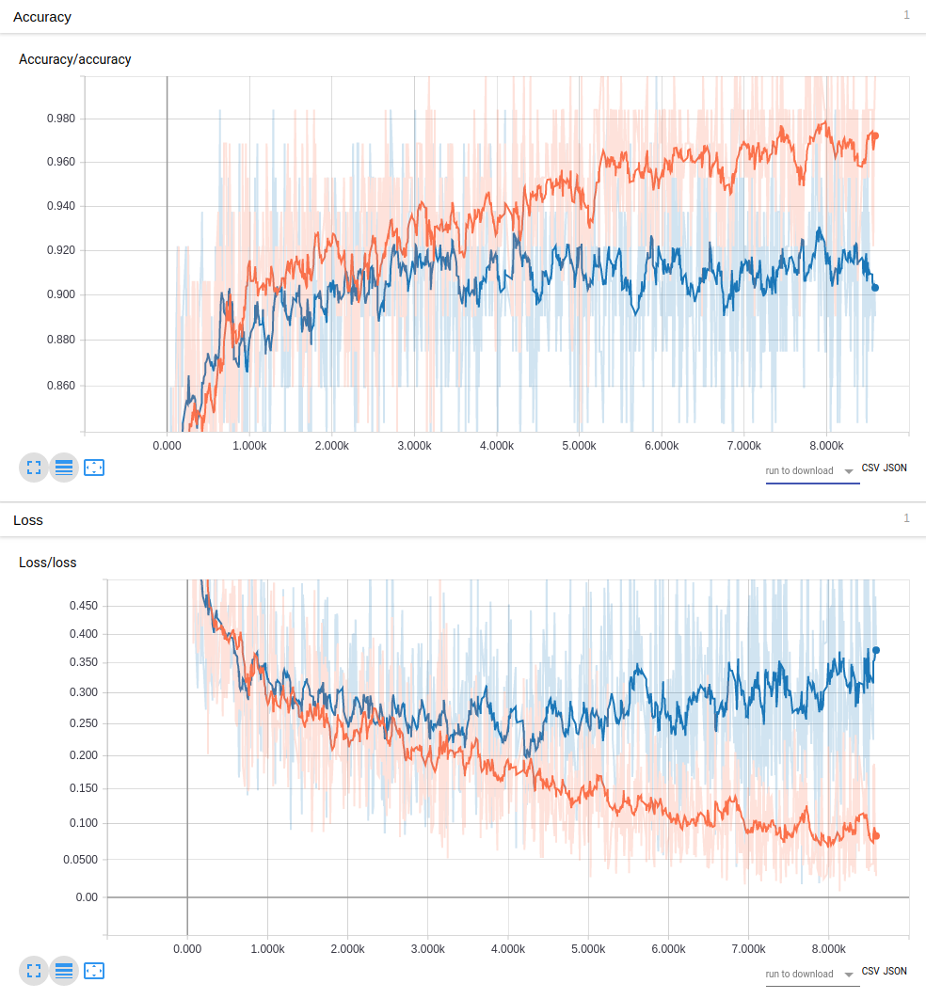
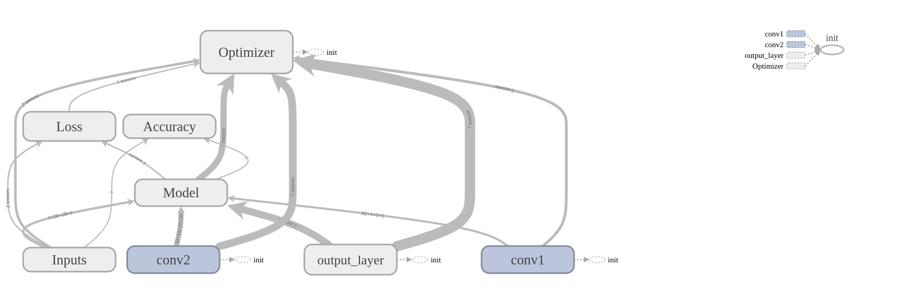
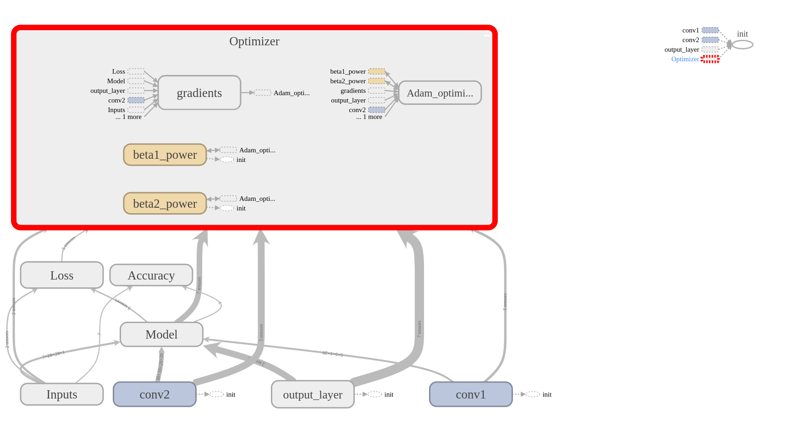
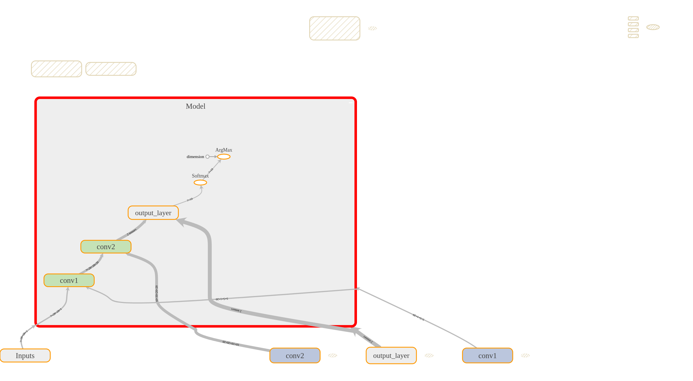
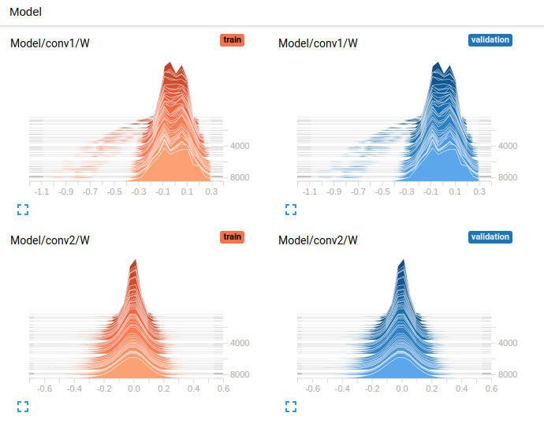

# TF02 - Simple CNN with tensorboard

Check "TF02_main.py" in this directory if you are interested in tensorboard visualizations.

Here are a few examples:

### Scalar

Scalar section in tensorboard can visualize your training process. Here I show you some results directly computed from "TF02_main.py".

The above figure is visualizing accuracy and loss for both training and validation. Training is shown as Orange and Validation is shown as Blue.

You can see that Validation is no longer improving from some point and this is typical in machine learning. When you see this, it means that you are training too much = over fitting your data. Therefore, one way to avoid such over-fitting is to stop training at the point where validation loss stops dropping.

Anyways, you can visualize these training procedures using "tf.summary.scalar" and you can check the code how to implement this in your code.

### Graphs

Have you ever wondered why tensorflow requires you to define a computational graph first and then start the session to compute everything? There is no short answer to it, but there are several advantages explained in the official [website](https://www.tensorflow.org/programmers_guide/graphs). And tensorflow has a very good visualization tool for the graph on tensorboard.

Let's take a look at the dataflow graph on "TF02_main.py".

This is the graph for the simple CNN implemented in the code. It's has 2 convolutional layers and you can see that in the bottom part of the image above. The "Model" in the center is taking inputs from "Inputs", "conv2", "output_layer", and "conv1". Basically, the "conv1" and "conv2" represent the two convolutional layers. Then the "Model" is used to calculate the "Loss" and "Accuracy" where you see arrows flowing into those two. Note that you also see arrows flowing into the two from "Inputs" because you need the "Inputs" to calculate those two values. Then at last, we have the "Optimizer" at the top which requires pretty much all the inputs to train and backpropage errors.

Very nice thing about tensorboard is that you can take a closer look at these networks interactively. You should definitely try on your own computer, but here I just show you some screenshots of different views in the graph.

For example, if you double click on "Optimizer", you get the following:

You can see what's inside in each node.

You can also click one of the node and trace the inputs:

It might be difficult to see on this image, but you can actually see the dimensions of each input on top of each arrow.

### Histograms

In deep learning, it is often difficult to see what's actually going on inside (e.g. weights) and tensorboard helps you to visualize those using histograms.

The first row is the histogram of weights in the first convolutional layer and the second row is for the second layer. First and second columns represent training and validation, but they are the same since we are not updating when validating. Each slice in this histogram represents each training and further at the back are the ones that were trained in the beginning and as you come to the front, you see the newly trained ones.